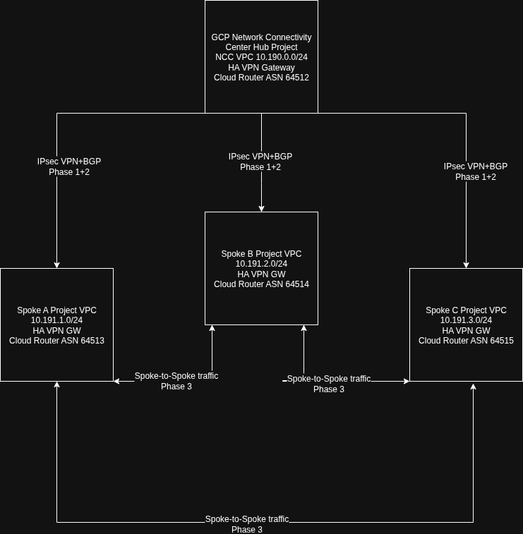

# Architecture Documentation

## Table of Contents
1. [Overview](#overview)
2. [Network Topology](#network-topology)
3. [Component Architecture](#component-architecture)
4. [Data Flow](#data-flow)
5. [Security Architecture](#security-architecture)
6. [State Management](#state-management)

## Overview

This project implements a **Google Cloud Platform (GCP) Network Connectivity Center (NCC) Hub-and-Spoke Architecture** using Terraform Infrastructure as Code. The architecture provides centralized network management with scalable spoke connectivity, enabling secure communication between geographically distributed workloads.

### Key Architectural Principles

- **Separation of Concerns**: Hub and spoke resources are managed independently
- **Phased Deployment**: Three-phase deployment ensures proper dependency resolution
- **State Isolation**: Each component maintains separate Terraform state files
- **Conditional Resources**: Optional components can be enabled/disabled without affecting core infrastructure
- **High Availability**: Redundant VPN tunnels and multi-zone deployments

---

## Network Topology

### High-Level Architecture

```
┌─────────────────────────────────────────────────────────────────────────────┐
│                          GCP Network Connectivity Center                    │
│                                                                             │
│                      ┌────────────────────────────────┐                     │
│                      │       NCC Hub Project          │                     │
│                      │   (ncc-project-467401)         │                     │
│                      │                                │                     │
│                      │  ┌──────────────────────────┐  │                     │
│                      │  │  NCC Hub VPC             │  │                     │
│                      │  │  10.190.0.0/24           │  │                     │
│                      │  │                          │  │                     │
│                      │  │  ┌────────────────────┐  │  │                     │
│                      │  │  │  HA VPN Gateway    │  │  │                     │
│                      │  │  │  (2 interfaces)    │  │  │                     │
│                      │  │  └────────────────────┘  │  │                     │
│                      │  │                          │  │                     │
│                      │  │  ┌────────────────────┐  │  │                     │
│                      │  │  │  Cloud Router      │  │  │                     │
│                      │  │  │  ASN: 64512        │  │  │                     │
│                      │  │  └────────────────────┘  │  │                     │
│                      │  └──────────────────────────┘  │                     │
│                      └────────────────────────────────┘                     │
│                                   |                                         │
│                    ┌──────────────┴───────────────┐                         │
│                    │                              │                         │
│          ┌─────────┴──────────┐         ┌─────────┴──────────┐              │
│          │  IPsec VPN Tunnel  │         │  IPsec VPN Tunnel  │              │
│          │  (Tunnel 0)        │         │  (Tunnel 1)        │              │
│          │  BGP Peering       │         │  BGP Peering       │              │
│          └─────────┬──────────┘         └─────────┬──────────┘              │
│                    │                              │                         │
│     ┌──────────────┴─────────────┬────────────────┴──────────────┐          │
│     │                            │                               │          │
│ ┌───▼──────────────────┐   ┌─────▼────────────────┐   ┌──────────▼─────┐    │
│ │  Spoke A Project     │   │  Spoke B Project     │   │  Spoke C       │    │
│ │  (pelagic-core)      │   │  (spoke-b-467801)    │   │  Project       │    │
│ │                      │   │                      │   │                │    │
│ │  ┌───────────────┐   │   │  ┌───────────────┐   │   │  ┌─────────┐   │    │
│ │  │ Spoke A VPC   │   │   │  │ Spoke B VPC   │   │   │  │ VPC     │   │    │
│ │  │ 10.191.1.0/24 │   │   │  │ 10.191.2.0/24 │   │   │  │ 10.x.x.x│   │    │
│ │  │               │   │   │  │               │   │   │  │         │   │    │
│ │  │ HA VPN GW     |   │   │  │ HA VPN GW     │   │   │  │ HA VPN  │   │    │
│ │  │ ASN: 64513    │   │   │  │ ASN: 64514    │   │   │  │         │   │    │
│ │  └───────────────┘   │   │  └───────────────┘   │   │  └─────────┘   │    │
│ └──────────────────────┘   └──────────────────────┘   └────────────────┘    │
│                                                                             │
└─────────────────────────────────────────────────────────────────────────────┘
```
---

## Component Architecture

### Phase 1: Core Infrastructure

```
┌─────────────────────────────────────────────────────────────────┐
│                        PHASE 1 DEPLOYMENT                       │
│                    (Core Infrastructure)                        │
└─────────────────────────────────────────────────────────────────┘

HUB DEPLOYMENT                          SPOKE DEPLOYMENT
┌──────────────────────────┐           ┌──────────────────────────┐
│ 1. VPC Network           │           │ 1. VPC Network           │
│ 2. Subnet                │           │ 2. Subnet                │
│ 3. HA VPN Gateway        │           │ 3. HA VPN Gateway        │
│ 4. Cloud Router          │           │ 4. Cloud Router          │
│ 5. NCC Hub Resource      │           │ 5. IAM Permissions       │
│ 6. GCS Secrets Bucket    │           │ 6. Test VM (optional)    │
│ 7. IAM Permissions       │           │                          │
│ 8. Test VM (optional)    │           │                          │
└──────────────────────────┘           └──────────────────────────┘
           │                                      │
           │                                      │
           ▼                                      ▼
   Terraform State:                      Terraform State:
   walid-hub-backend/                    walid-spoke-a-backend/
   hub-state                             spoke-a-state
```

### Phase 2: VPN Connectivity

```
┌─────────────────────────────────────────────────────────────────┐
│                        PHASE 2 DEPLOYMENT                       │
│                    (VPN Connectivity)                           │
└─────────────────────────────────────────────────────────────────┘

HUB DEPLOYMENT                          SPOKE DEPLOYMENT
┌──────────────────────────┐           ┌──────────────────────────┐
│ Reads from Spoke State:  │           │ Reads from Hub State:    │
│ - spoke_vpn_gateway_id   │           │ - ncc_vpn_gateway_id     │
│ - spoke_subnet_cidr      │           │ - ncc_subnet_cidr        │
│ - spoke_asn              │           │ - ncc_asn                │
├──────────────────────────┤           ├──────────────────────────┤
│ Creates:                 │           │ Creates:                 │
│ 1. VPN Tunnels (2x)      │◄─────────►│ 1. VPN Tunnels (2x)      │
│ 2. BGP Peers (2x)        │           │ 2. BGP Peers (2x)        │
│ 3. NCC Spokes            │           │ 3. Router Interfaces     │
│ 4. Firewall Rules        │           │ 4. Firewall Rules        │
│ 5. Shared Secrets        │           │                          │
└──────────────────────────┘           └──────────────────────────┘
           │                                      │
           └──────────────┬───────────────────────┘
                          ▼
                  IPsec Tunnels +
                  BGP Routing Established
```

### Phase 3: Spoke-to-Spoke Communication

```
┌─────────────────────────────────────────────────────────────────┐
│                        PHASE 3 DEPLOYMENT                       │
│                (Spoke-to-Spoke Communication)                   │
└─────────────────────────────────────────────────────────────────┘

HUB DEPLOYMENT                          SPOKE DEPLOYMENT
┌──────────────────────────┐           ┌──────────────────────────┐
│ Aggregates all spoke     │           │ Reads from Hub State:    │
│ CIDRs from state files:  │           │ - all_spoke_cidrs        │
│                          │           │                          │
│ Outputs:                 │           │ Creates:                 │
│ all_spoke_cidrs = [      │──────────►│ Dynamic Firewall Rules   │
│   "10.191.1.0/24",       │           │ - Allow ingress from     │
│   "10.191.2.0/24",       │           │   all other spoke CIDRs  │
│   "10.191.3.0/24"        │           │ - Enables spoke-to-spoke │
│ ]                        │           │   communication          │
└──────────────────────────┘           └──────────────────────────┘
                                                   │
                                                   ▼
                                        Spoke A ◄─────► Spoke B
                                           ▲              ▲
                                           └─────┬────────┘
                                                 │
                                                 ▼
                                              Spoke C
```

---

## Data Flow

### VPN Tunnel Establishment

```
┌──────────────────────────────────────────────────────────────────────┐
│                    VPN TUNNEL ESTABLISHMENT FLOW                      │
└──────────────────────────────────────────────────────────────────────┘

1. Pre-Shared Key Generation (Hub)
   ┌────────────────────────────────┐
   │ Random PSK Generated           │
   │ Stored in GCS Secrets Bucket   │
   │ Shared with Spoke via IAM      │
   └────────────────────────────────┘
                │
                ▼
2. Tunnel Creation (Both Sides)
   ┌────────────────────────────────┐
   │ Hub creates tunnel pointing    │
   │ to Spoke VPN Gateway           │
   │                                │
   │ Spoke creates tunnel pointing  │
   │ to Hub VPN Gateway             │
   └────────────────────────────────┘
                │
                ▼
3. IPsec Negotiation
   ┌────────────────────────────────┐
   │ IKEv2 Negotiation              │
   │ Phase 1: ISAKMP SA             │
   │ Phase 2: IPsec SA              │
   │ Encryption: AES-256            │
   └────────────────────────────────┘
                │
                ▼
4. BGP Peering
   ┌────────────────────────────────┐
   │ Router Interface Creation      │
   │ BGP Session Establishment      │
   │ Route Exchange                 │
   │ - Hub advertises 10.190.0.0/24 │
   │ - Spoke advertises 10.191.x.0/24│
   └────────────────────────────────┘
                │
                ▼
5. NCC Spoke Attachment
   ┌────────────────────────────────┐
   │ Hub creates NCC Spoke resource │
   │ Links VPN tunnels to NCC Hub   │
   │ Enables centralized routing    │
   └────────────────────────────────┘
```

### Traffic Flow: Spoke-to-Spoke Communication

```
┌──────────────────────────────────────────────────────────────────────┐
│                  SPOKE-TO-SPOKE TRAFFIC FLOW                         │
└──────────────────────────────────────────────────────────────────────┘

Spoke A (10.191.1.0/24) wants to reach Spoke B (10.191.2.0/24)

1. Initial Packet
   ┌─────────────────────────┐
   │ VM in Spoke A           │
   │ Src: 10.191.1.5         │
   │ Dst: 10.191.2.10        │
   └─────────────────────────┘
              │
              ▼
2. Route Lookup (Spoke A)
   ┌─────────────────────────┐
   │ Cloud Router checks     │
   │ BGP learned routes      │
   │ Next hop: Hub VPN GW    │
   └─────────────────────────┘
              │
              ▼
3. VPN Tunnel to Hub
   ┌─────────────────────────┐
   │ Packet encrypted        │
   │ IPsec tunnel to Hub     │
   │ ESP encapsulation       │
   └─────────────────────────┘
              │
              ▼
4. Hub Routing Decision
   ┌─────────────────────────┐
   │ Hub Cloud Router        │
   │ Route to Spoke B learned│
   │ via BGP from Spoke B    │
   │ Next hop: Spoke B VPN   │
   └─────────────────────────┘
              │
              ▼
5. VPN Tunnel to Spoke B
   ┌─────────────────────────┐
   │ Decrypted at Hub        │
   │ Re-encrypted for Spoke B│
   │ Sent via VPN tunnel     │
   └─────────────────────────┘
              │
              ▼
6. Delivery to Spoke B
   ┌─────────────────────────┐
   │ Decrypted at Spoke B    │
   │ Firewall check (Phase 3)│
   │ Delivered to 10.191.2.10│
   └─────────────────────────┘
```

---

## Security Architecture

### IAM Roles and Permissions

```
┌──────────────────────────────────────────────────────────────────────┐
│                       IAM SECURITY MODEL                             │
└──────────────────────────────────────────────────────────────────────┘

HUB PROJECT
┌────────────────────────────────────────────────────────────────┐
│ Hub Service Account                                            │
│ (hub-terraform-sa@ncc-project-467401.iam.gserviceaccount.com)  │
├────────────────────────────────────────────────────────────────┤
│ Roles in Hub Project:                                          │
│ - roles/compute.networkAdmin       (VPC, VPN, Firewall mgmt)   │
│ - roles/networkconnectivity.hubAdmin  (NCC Hub operations)     │
│ - roles/storage.admin              (GCS bucket management)     │
├────────────────────────────────────────────────────────────────┤
│ Access Granted to Spoke Service Accounts:                      │
│ - roles/storage.objectViewer       (Read shared secrets)       │
│ - roles/storage.objectAdmin        (Access hub state files)    │
│ - roles/networkconnectivity.spokeAdmin (NCC spoke operations)  │
└────────────────────────────────────────────────────────────────┘

SPOKE PROJECTS
┌────────────────────────────────────────────────────────────────┐
│ Spoke Service Accounts                                         │
│ (spoke-a-sa@pelagic-core-467122.iam.gserviceaccount.com)       │
├────────────────────────────────────────────────────────────────┤
│ Roles in Spoke Project:                                        │
│ - roles/compute.networkAdmin       (VPC, VPN, Firewall mgmt)   │
│ - roles/storage.admin              (GCS bucket management)     │
│ - roles/run.admin                  (Cloud Run - Task 2)        │
├────────────────────────────────────────────────────────────────┤
│ Access Granted to Hub Service Account:                         │
│ - roles/compute.networkUser        (Access network resources)  │
│ - roles/storage.objectViewer       (Read spoke state files)    │
└────────────────────────────────────────────────────────────────┘
```

### Firewall Rules Architecture

```
┌──────────────────────────────────────────────────────────────────────┐
│                       FIREWALL RULES HIERARCHY                       │
└──────────────────────────────────────────────────────────────────────┘

PHASE 1 RULES (Implicit)
┌────────────────────────────────────────────────────────────────┐
│ Default VPC Rules:                                             │
│ - Deny all ingress by default                                  │
│ - Allow all egress by default                                  │
└────────────────────────────────────────────────────────────────┘

PHASE 2 RULES (VPN Connectivity)
┌────────────────────────────────────────────────────────────────┐
│ Hub Firewall Rules:                                            │
│ - Allow ESP (IP Protocol 50) from all spoke VPN gateways       │
│ - Allow UDP/500 (IKE) from all spoke VPN gateways              │
│ - Allow UDP/4500 (NAT-T) from all spoke VPN gateways           │
│ - Allow TCP/179 (BGP) from BGP peer IPs                        │
├────────────────────────────────────────────────────────────────┤
│ Spoke Firewall Rules:                                          │
│ - Allow ESP (IP Protocol 50) from hub VPN gateway              │
│ - Allow UDP/500 (IKE) from hub VPN gateway                     │
│ - Allow UDP/4500 (NAT-T) from hub VPN gateway                  │
│ - Allow TCP/179 (BGP) from BGP peer IPs                        │
└────────────────────────────────────────────────────────────────┘

PHASE 3 RULES (Spoke-to-Spoke)
┌────────────────────────────────────────────────────────────────┐
│ Dynamic Spoke Rules:                                           │
│ - Allow all traffic from all_spoke_cidrs[] (Priority: 1000)    │
│ - Enables full spoke-to-spoke communication                    │
│ - Applied to all spoke VPCs                                    │
└────────────────────────────────────────────────────────────────┘

TASK 3 RULES (Extended Functionality)
┌────────────────────────────────────────────────────────────────┐
│ Windows Jump Box:                                              │
│ - Allow TCP/3389 (RDP) from 0.0.0.0/0 (Internet)               │
│ - Target: windows-jumpbox tag                                  │
├────────────────────────────────────────────────────────────────┤
│ Windows to Linux:                                              │
│ - Allow TCP/80 from windows-jumpbox tag                        │
│ - Target: linux-webserver tag                                  │
│ - Tag-based rules (not IP-based)                               │
└────────────────────────────────────────────────────────────────┘
```

### Encryption and Key Management

```
┌──────────────────────────────────────────────────────────────────────┐
│                    ENCRYPTION ARCHITECTURE                           │
└──────────────────────────────────────────────────────────────────────┘

1. VPN Tunnel Encryption
   ┌────────────────────────────────┐
   │ IPsec Configuration:           │
   │ - IKEv2 Protocol               │
   │ - AES-256-GCM Encryption       │
   │ - SHA2-256 Authentication      │
   │ - PFS Group 14 (2048-bit DH)   │
   └────────────────────────────────┘

2. Pre-Shared Keys
   ┌────────────────────────────────┐
   │ Generation: Terraform random   │
   │ Length: 32 bytes (256-bit)     │
   │ Storage: GCS Secrets Bucket    │
   │ Access: IAM-controlled         │
   │ Rotation: Manual (recommended) │
   └────────────────────────────────┘

3. State File Encryption
   ┌────────────────────────────────┐
   │ GCS Bucket Features:           │
   │ - Encryption at rest (default) │
   │ - Versioning enabled           │
   │ - IAM-based access control     │
   │ - Audit logging enabled        │
   └────────────────────────────────┘

4. Service Account Keys
   ┌────────────────────────────────┐
   │ Key Management:                │
   │ - JSON keys stored securely    │
   │ - Outside version control      │
   │ - Rotation recommended: 90 days│
   │ - Principle of least privilege │
   └────────────────────────────────┘
```

---

## State Management

### State File Architecture

```
┌──────────────────────────────────────────────────────────────────────┐
│                    TERRAFORM STATE ARCHITECTURE                      │
└──────────────────────────────────────────────────────────────────────┘

GCS BUCKET STRUCTURE
┌────────────────────────────────────────────────────────────────┐
│ walid-hub-backend/                                             │
│ └── hub-state/                                                 │
│     └── default.tfstate          (Hub Terraform state)         │
├────────────────────────────────────────────────────────────────┤
│ walid-spoke-a-backend/                                         │
│ └── spoke-a-state/                                             │
│     └── default.tfstate          (Spoke A Terraform state)     │
├────────────────────────────────────────────────────────────────┤
│ walid-spoke-b-backend/                                         │
│ └── spoke-b-state/                                             │
│     └── default.tfstate          (Spoke B Terraform state)     │
├────────────────────────────────────────────────────────────────┤
│ walid-secrets-backend/                                         │
│ └── shared-secrets/                                            │
│     ├── spoke-a-tunnel-0-psk     (VPN pre-shared keys)         │
│     ├── spoke-a-tunnel-1-psk                                   │
│     ├── spoke-b-tunnel-0-psk                                   │
│     └── spoke-b-tunnel-1-psk                                   │
└────────────────────────────────────────────────────────────────┘
```

### State Data Flow

```
┌──────────────────────────────────────────────────────────────────────┐
│                     STATE DATA DEPENDENCIES                          │
└──────────────────────────────────────────────────────────────────────┘

PHASE 1: Core Infrastructure
┌─────────────────┐                    ┌─────────────────┐
│ Hub Phase 1     │                    │ Spoke A Phase 1 │
│ Deployment      │                    │ Deployment      │
├─────────────────┤                    ├─────────────────┤
│ Outputs:        │                    │ Outputs:        │
│ - ncc_vpc_id    │                    │ - spoke_vpc_id  │
│ - ncc_subnet    │                    │ - spoke_subnet  │
│ - ncc_vpn_gw_id │◄───────────────────┤ - spoke_vpn_gw  │
│ - ncc_asn       │  Spoke reads via   │ - spoke_asn     │
└─────────────────┘  terraform_remote_ └─────────────────┘
                     state data source

PHASE 2: VPN Connectivity
┌─────────────────┐                    ┌─────────────────┐
│ Hub Phase 2     │                    │ Spoke A Phase 2 │
│ Deployment      │                    │ Deployment      │
├─────────────────┤                    ├─────────────────┤
│ Reads:          │                    │ Reads:          │
│ - spoke_vpn_gw  │◄───────────────────┤ - ncc_vpn_gw_id │
│ - spoke_subnet  │  Bidirectional     │ - ncc_subnet    │
│ - spoke_asn     │  state dependency  │ - ncc_asn       │
├─────────────────┤                    ├─────────────────┤
│ Creates:        │                    │ Creates:        │
│ - VPN tunnels   │◄──────────────────►│ - VPN tunnels   │
│ - BGP peers     │                    │ - BGP peers     │
│ - NCC spokes    │                    │ - Router intfs  │
└─────────────────┘                    └─────────────────┘

PHASE 3: Spoke-to-Spoke
┌─────────────────┐                    ┌─────────────────┐
│ Hub Phase 3     │                    │ Spoke A Phase 3 │
│ Deployment      │                    │ Deployment      │
├─────────────────┤                    ├─────────────────┤
│ Reads:          │                    │ Reads:          │
│ - All spoke     │                    │ - Hub Phase 3   │
│   state files   │                    │   outputs       │
├─────────────────┤                    ├─────────────────┤
│ Outputs:        │                    │ Creates:        │
│ all_spoke_cidrs │───────────────────►│ - Firewall rules│
│ = [             │                    │   for all spoke │
│   "10.191.1.../24",                  │   CIDRs         │
│   "10.191.2.../24"                   │                 │
│ ]               │                    │                 │
└─────────────────┘                    └─────────────────┘
```

### State Locking and Consistency

```
┌──────────────────────────────────────────────────────────────────────┐
│                    STATE LOCKING MECHANISM                           │
└──────────────────────────────────────────────────────────────────────┘

GCS Backend Configuration
┌────────────────────────────────────────────────────────────────┐
│ backend "gcs" {                                                │
│   bucket  = "walid-hub-backend"                                │
│   prefix  = "hub-state"                                        │
│ }                                                              │
│                                                                │
│ Features:                                                      │
│ - State locking: Prevents concurrent modifications             │
│ - Consistency: Read-after-write consistency                    │
│ - Versioning: Enables state rollback                           │
│ - Encryption: At-rest encryption by default                    │
└────────────────────────────────────────────────────────────────┘

State Update Flow
┌────────────────────────────────────────────────────────────────┐
│ 1. Terraform acquires lock on state file                       │
│ 2. Reads current state from GCS                                │
│ 3. Plans infrastructure changes                                │
│ 4. Applies changes to GCP                                      │
│ 5. Updates state file in GCS                                   │
│ 6. Releases lock                                               │
└────────────────────────────────────────────────────────────────┘
```

---

## Additional Components

### Task 2: Cloud Run Multi-Revision Architecture

```
┌──────────────────────────────────────────────────────────────────────┐
│              TASK 2: CLOUD RUN TRAFFIC SPLITTING                     │
└──────────────────────────────────────────────────────────────────────┘

                      Internet Traffic
                            │
                            ▼
                    ┌───────────────┐
                    │  Cloud Run    │
                    │  Service      │
                    └───────────────┘
                            │
                    ┌───────┴────────┐
                    │ Traffic Split  │
                    └───────┬────────┘
                            │
        ┌───────────────────┼───────────────────┐
        │                   │                   │
        ▼                   ▼                   ▼
    ┌────────┐          ┌────────┐          ┌────────┐
    │Rev main│ 40%      │Rev 2   │ 40%      │Rev 3   │ 10%
    │        │          │        │          │        │
    └────────┘          └────────┘          └────────┘
                                                  │
                                                  ▼
                                            ┌────────┐
                                            │Rev 4   │ 10%
                                            │        │
                                            └────────┘

Deployment Strategy:
┌────────────────────────────────────────────────────────────────┐
│ 1. Terraform creates base service infrastructure               │
│ 2. gcloud CLI deploys revisions with predictable suffixes:     │
│    - service-main                                              │
│    - service-revision2                                         │
│    - service-revision3                                         │
│    - service-revision4                                         │
│ 3. gcloud CLI configures traffic splitting                     │
└────────────────────────────────────────────────────────────────┘
```

### Task 3: Extended Spoke Architecture

```
┌──────────────────────────────────────────────────────────────────────┐
│            TASK 3: WINDOWS JUMPBOX + LINUX WEB SERVERS               │
└──────────────────────────────────────────────────────────────────────┘

                        Internet
                            │
                            ▼
                    ┌───────────────┐
                    │ Public IP     │
                    │ RDP Access    │
                    └───────┬───────┘
                            │
                    ┌───────▼────────┐
                    │ Windows VM     │
                    │ (asia-ne1)     │
                    │ Tag: win-jump  │
                    └───────┬────────┘
                            │
                    Internal Network
                            │
                    ┌───────▼────────┐
                    │ Internal LB    │
                    │ 10.191.1.100   │
                    └───────┬────────┘
                            │
        ┌───────────────────┼───────────────────┐
        │                   │                   │
        ▼                   ▼                   ▼
    ┌────────┐          ┌────────┐          ┌────────┐
    │Linux VM│          │Linux VM│          │Linux VM│
    │Zone A  │          │Zone B  │          │Zone C  │
    │Tag:    │          │Tag:    │          │Tag:    │
    │linux-ws│          │linux-ws│          │linux-ws│
    └────────┘          └────────┘          └────────┘
        │                   │                   │
        └───────────────────┼───────────────────┘
                            ▼
                    ┌───────────────┐
                    │ Cloud NAT     │
                    │ (egress only) │
                    └───────────────┘
                            │
                            ▼
                        Internet
                    (package updates)

Security Model:
┌────────────────────────────────────────────────────────────────┐
│ - Windows VM: Public RDP access (TCP/3389 from 0.0.0.0/0)      │
│ - Linux VMs: Private only (no public IPs)                      │
│ - Windows → Linux: TCP/80 via tag-based firewall               │
│ - Linux → Internet: Egress via Cloud NAT                       │
│ - Load Balancer: Internal only (RFC1918 address)               │
└────────────────────────────────────────────────────────────────┘
```

---

## Summary

This architecture provides:

1. **Scalable Hub-and-Spoke Topology**: Centralized network management with easy spoke addition
2. **High Availability**: Redundant VPN tunnels, multi-zone deployments, auto-healing
3. **Security by Design**: Defense in depth with multiple security layers
4. **Phased Deployment**: Predictable rollout with clear dependency management
5. **State Isolation**: Independent Terraform state files prevent blast radius
6. **Optional Extensions**: Cloud Run and extended compute capabilities via conditional modules
7. **Production-Ready**: Comprehensive IAM, encryption, logging, and monitoring

This documentation provides recruiters and technical stakeholders with a complete understanding of the architecture's design, implementation, and operational characteristics.
