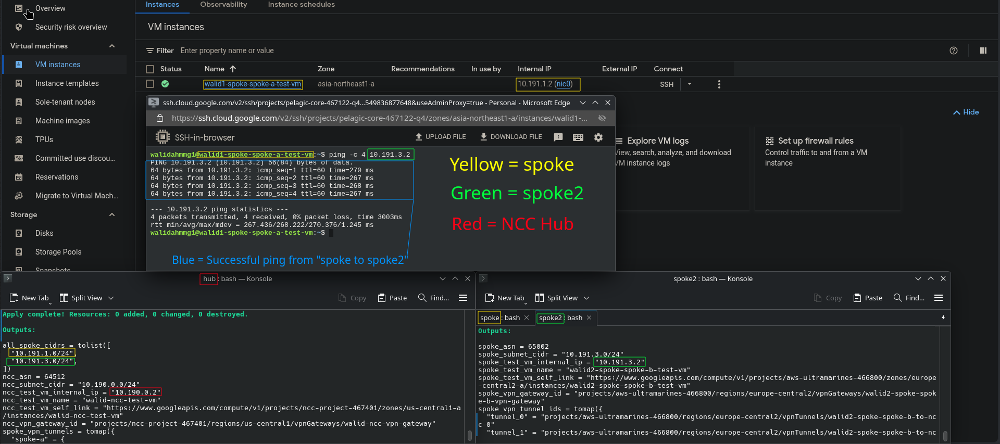
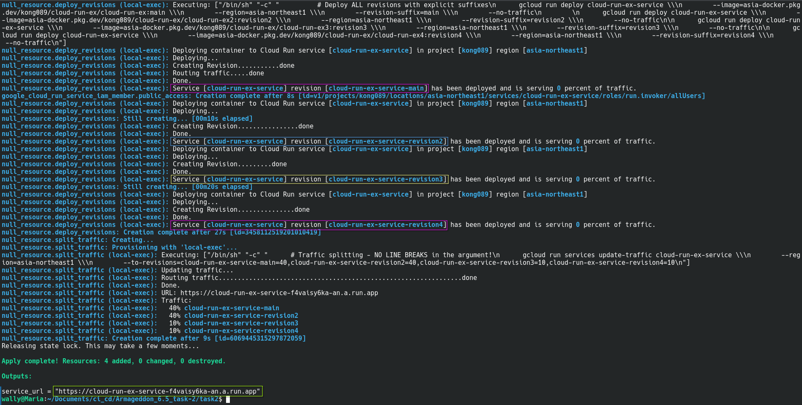
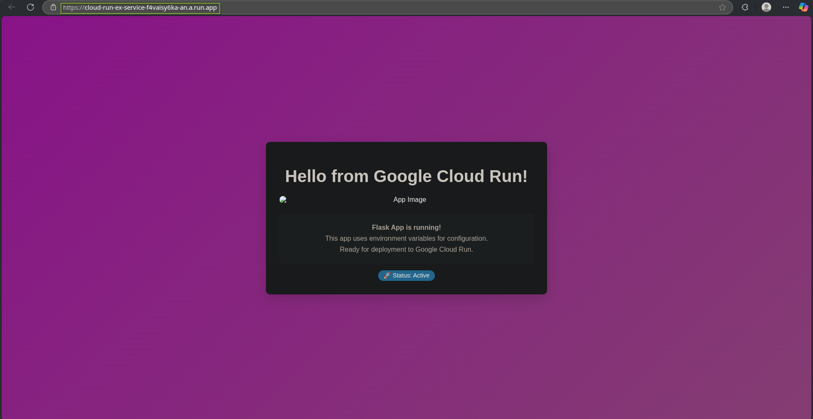
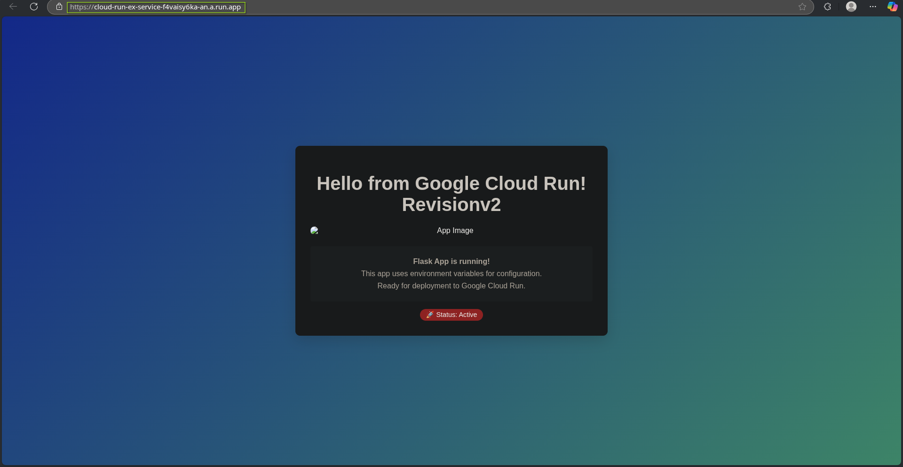
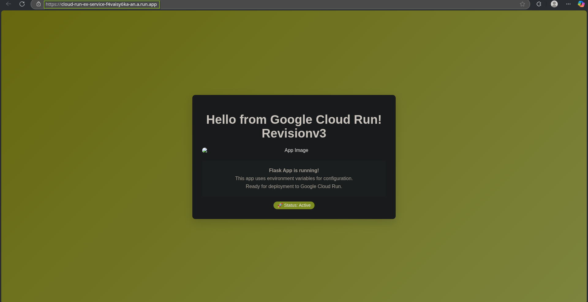
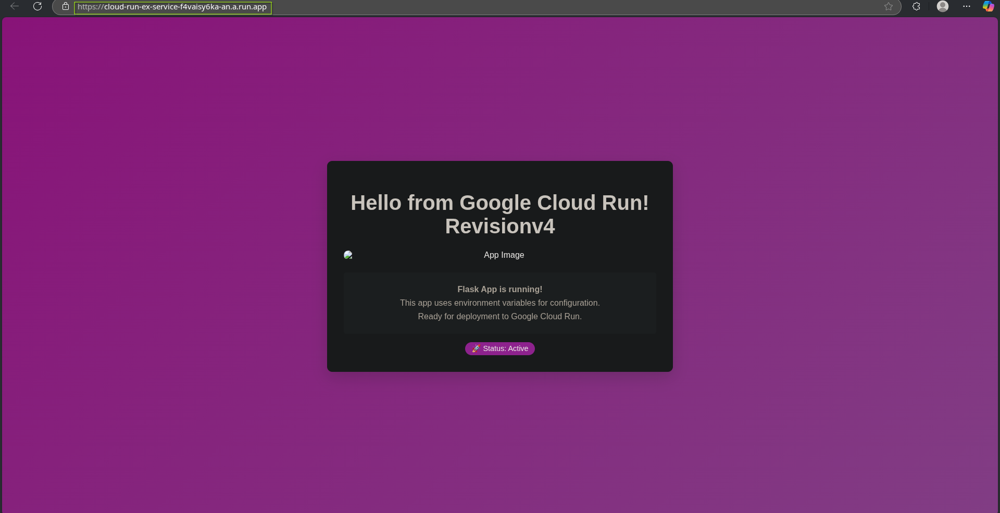
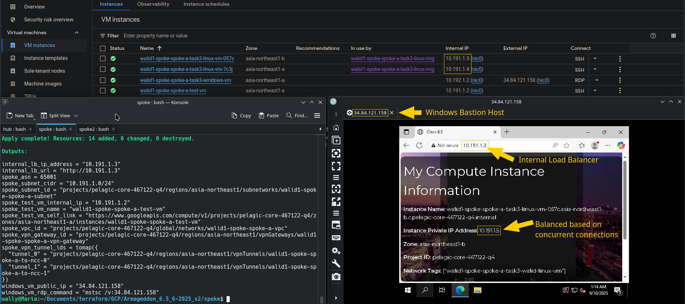
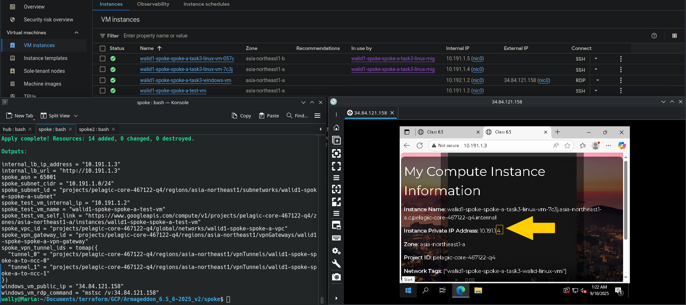
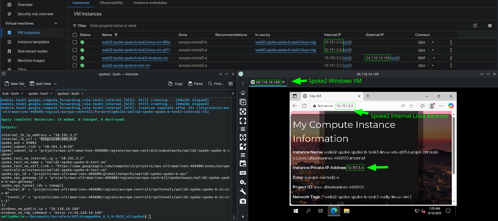
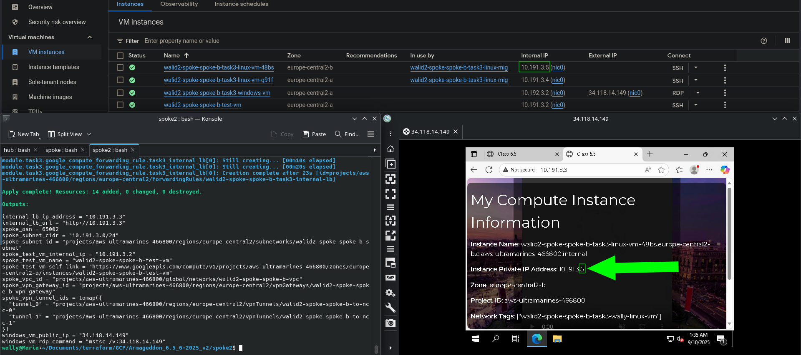

# GCP Network Connectivity Center (NCC) Hub-and-Spoke Architecture

[](https://www.terraform.io/)
[](https://cloud.google.com/network-connectivity/docs/network-connectivity-center)
[](LICENSE)

**Enterprise-grade, production-ready Infrastructure as Code for GCP Network Connectivity Center deployments**

This repository provides a comprehensive Terraform configuration for deploying a Google Cloud Platform (GCP) Network Connectivity Center (NCC) hub-and-spoke architecture with multi-project support, phased deployment strategy, and optional Cloud Run and extended compute capabilities. It builds on the proof-of-concept from [Terraform-GCP-NCC-Hub-Spoke-Architecture (v1)](https://github.com/Walid-Ahmed-Dev/Terraform-GCP-NCC-Hub-Spoke-Architecture), introducing enhanced features for production environments.

## Quick Links

- **[Architecture Documentation](ARCHITECTURE.md)** - Detailed technical architecture and design decisions
- **[Deployment Guide](DEPLOYMENT_GUIDE.md)** - Step-by-step deployment instructions with troubleshooting
- **[Security Considerations](SECURITY.md)** - Credential management patterns and security best practices
- **[Hub Configuration](hub/README.md)** - Hub-specific configuration and usage
- **[Spoke Configuration](spoke/README.md)** - Spoke-specific configuration and usage
- **[Task 2: Cloud Run](spoke3/modules/task2/README.md)** - Multi-revision Cloud Run deployment
- **[Task 3: Extended Infrastructure](spoke/modules/task3/README.md)** - Windows jump box and Linux web servers

## Table of Contents

- [Overview](#overview)
- [Architecture Highlights](#architecture-highlights)
- [Project Structure](#project-structure)
- [Key Features](#key-features)
- [Quick Start](#quick-start)
- [Deployment Phases](#deployment-phases)
- [Optional Components](#optional-components)
- [Screenshots](#screenshots)
- [Technical Specifications](#technical-specifications)
- [Contributing](#contributing)
- [License](#license)

---

## Overview

This project implements a **production-grade, scalable network architecture** on Google Cloud Platform using Network Connectivity Center (NCC) to establish secure, encrypted connectivity between multiple GCP projects. The architecture supports:

- **Multi-region deployments** with centralized hub management
- **Automatic route propagation** via BGP
- **High-availability VPN tunnels** with 99.99% SLA
- **Dynamic spoke-to-spoke communication** without manual route management
- **Flexible workload deployment** including Cloud Run and Windows/Linux VMs
- **State management isolation** using GCS backends

### Architecture Highlights

```
                         Cloud Network Connectivity Center
                                      │
                         ┌────────────┴────────────┐
                         │      Hub Project        │
                         │   (Central Management)  │
                         └────────────┬────────────┘
                                      │
                    ┌─────────────────┼────────────────┐
                    │                 │                │
              ┌─────▼─────┐      ┌────▼─────┐     ┌────▼─────┐
              │  Spoke A  │      │ Spoke B  │     │ Spoke C  │
              │  Project  │      │ Project  │     │ Project  │
              │           │◄─────┤          ├────►│          │
              └───────────┘      └──────────┘     └──────────┘
                   Spoke-to-Spoke Communication (Phase 3)
```

**Key Benefits:**
- Centralized network policy management
- Seamless cross-project connectivity
- Automated route learning and propagation
- No complex VPN mesh topologies required
- Support for hybrid and multi-cloud extensions

---

## Project Structure

```
Terraform-GCP-NCC-Hub-Spoke-Architecture_v2/
├── ARCHITECTURE.md              # Detailed architecture documentation
├── DEPLOYMENT_GUIDE.md          # Step-by-step deployment instructions
├── README.md                    # This file
├── LICENSE                      # MIT License
├── pics/                        # Architecture diagrams and screenshots
│   ├── task1_1.png             # Spoke-to-spoke communication
│   ├── task2.png               # Cloud Run deployment
│   ├── revision1-4.png         # Cloud Run revisions
│   └── task3_1-4.png           # Extended infrastructure
├── hub/                         # Hub Terraform configuration
│   ├── main.tf                 # Hub module instantiation
│   ├── variables.tf            # Hub input variables
│   ├── outputs.tf              # Hub outputs
│   ├── terraform.tfvars        # Hub configuration values
│   ├── README.md               # Hub-specific documentation
│   └── modules/
│       └── ncc-hub-module/     # Reusable hub module
│           ├── main.tf         # VPC, VPN, NCC hub, IAM
│           ├── variables.tf    # Module variables
│           └── outputs.tf      # Module outputs
├── spoke/                       # Spoke A Terraform configuration
│   ├── main.tf                 # Spoke module instantiation
│   ├── variables.tf            # Spoke input variables
│   ├── outputs.tf              # Spoke outputs
│   ├── terraform.tfvars        # Spoke A configuration values
│   ├── README.md               # Spoke-specific documentation
│   └── modules/
│       ├── ncc-spoke-module/   # Reusable spoke module
│       │   ├── main.tf         # VPC, VPN, BGP, firewall
│       │   ├── variables.tf    # Module variables
│       │   └── outputs.tf      # Module outputs
│       └── task3/              # Extended infrastructure module
│           ├── main.tf         # Windows VM, Linux VMs, LB
│           ├── variables.tf    # Task 3 variables
│           ├── outputs.tf      # Task 3 outputs
│           └── README.md       # Task 3 documentation
├── spoke2/                      # Spoke B (similar to spoke/)
└── spoke3/                      # Spoke C (includes Task 2)
    └── modules/
        └── task2/              # Cloud Run module
            ├── main.tf         # Cloud Run service
            ├── variables.tf    # Task 2 variables
            ├── outputs.tf      # Task 2 outputs
            └── README.md       # Task 2 documentation
```

---

## Key Features

### Core Architecture

- **Separate Hub and Spoke Management**: Independent Terraform configurations enable team autonomy
- **Three-Phase Deployment Strategy**: Ensures proper dependency resolution and predictable rollout
  - **Phase 1**: Core infrastructure (VPCs, subnets, VPN gateways, routers)
  - **Phase 2**: VPN connectivity (tunnels, BGP peering, NCC spokes)
  - **Phase 3**: Spoke-to-spoke communication (dynamic firewall rules)
- **GCS-Based State Management**: Separate state files with locking and versioning
- **Multi-Spoke Support**: Dynamically scale to any number of spokes via `spoke_configs`
- **High Availability**: Dual VPN tunnels per spoke with automatic failover

### Security & Compliance

- **Defense in Depth**: Multiple security layers (IAM, firewall rules, private subnets)
- **Least Privilege IAM**: Granular service account permissions
- **Encrypted VPN Tunnels**: IKEv2 with AES-256-GCM encryption
- **Tag-Based Firewall Rules**: Flexible access control without IP dependencies
- **Credential Isolation**: Intentional design pattern storing credentials outside project directory
- **Audit Logging**: Full visibility into all network operations

> **Note on Credentials**: This project uses relative paths to credentials stored outside the project directory (e.g., `../../../G-secrets/`). This is an intentional design choice prioritizing development workflow simplicity while maintaining security through physical separation. See [SECURITY.md](SECURITY.md) for full explanation and production alternatives.

### Optional Extensions

#### Task 2: Cloud Run Multi-Revision Deployment
- **Hybrid Terraform + gcloud CLI** approach for predictable revision naming
- **Traffic Splitting**: Precise percentage-based routing (e.g., 40%/40%/10%/10%)
- **Cost Optimized**: Idle revisions scale to zero (pay only for requests)
- **Blue-Green Deployments**: Support for canary releases and A/B testing

#### Task 3: Extended Spoke Infrastructure
- **Windows Jump Box**: Public RDP access for administrative purposes
- **Linux Web Servers**: Member-specific VMs with personalized content
- **Internal Load Balancer**: High-availability distribution across multiple zones
- **Private NAT**: Secure outbound internet access for package updates
- **Tag-Based Access Control**: Windows → Linux communication via firewall tags

---

## Quick Start

### Prerequisites

- Terraform >= 1.0.0
- Google Cloud SDK (`gcloud`)
- At least 2 GCP projects with billing enabled
- Service accounts with appropriate IAM roles

### 5-Minute Deployment (Phase 1)

```bash
# 1. Clone the repository
git clone https://github.com/Walid-Ahmed-Dev/Terraform-GCP-NCC-Hub-Spoke-Architecture_v2.git
cd Terraform-GCP-NCC-Hub-Spoke-Architecture_v2

# 2. Configure hub
cd hub
cp terraform.tfvars.example terraform.tfvars
# Edit terraform.tfvars with your project details
terraform init
terraform apply -var="deploy_phase2=false" -var="deploy_phase3=false"

# 3. Configure spoke
cd ../spoke
cp terraform.tfvars.example terraform.tfvars
# Edit terraform.tfvars with your project details
terraform init
terraform apply -var="deploy_phase2=false" -var="deploy_phase3=false"

# 4. Enable VPN connectivity (Phase 2)
cd ../hub
terraform apply -var="deploy_phase2=true" -var="deploy_phase3=false"

cd ../spoke
terraform apply -var="deploy_phase2=true" -var="deploy_phase3=false"

# 5. Enable spoke-to-spoke communication (Phase 3)
cd ../hub
terraform apply -var="deploy_phase2=true" -var="deploy_phase3=true"

cd ../spoke
terraform apply -var="deploy_phase2=true" -var="deploy_phase3=true"
```

For detailed setup instructions, see the **[Deployment Guide](DEPLOYMENT_GUIDE.md)**.

---

## Deployment Phases

### Phase 1: Core Infrastructure

**Deploy foundational network resources without connectivity**

- VPC networks and subnets
- HA VPN gateways (dual interfaces per spoke)
- Cloud Routers with BGP configuration
- NCC Hub resource
- IAM roles and permissions
- GCS buckets for state and secrets
- Optional test VMs

**Command:**
```bash
terraform apply -var="deploy_phase2=false" -var="deploy_phase3=false"
```

### Phase 2: VPN Connectivity

**Establish encrypted tunnels and BGP peering**

- VPN tunnels (2 per spoke for HA)
- BGP sessions with automatic route exchange
- NCC spoke resources linking tunnels to hub
- Firewall rules for VPN traffic (ESP, IKE, NAT-T, BGP)
- Pre-shared secret management via GCS

**Command:**
```bash
terraform apply -var="deploy_phase2=true" -var="deploy_phase3=false"
```

**Verification:**
```bash
# Check VPN tunnel status (should be "Established")
gcloud compute vpn-tunnels list --project=<PROJECT_ID>

# Check BGP sessions (should be "BGP_SESSION_UP")
gcloud compute routers get-status <ROUTER_NAME> \
  --region=<REGION> \
  --project=<PROJECT_ID>
```

### Phase 3: Spoke-to-Spoke Communication

**Enable direct communication between spokes**

- Hub aggregates all spoke CIDRs
- Dynamic firewall rules created in each spoke
- Bidirectional spoke-to-spoke traffic allowed
- Routes learned via BGP enable seamless communication

**Command:**
```bash
# Hub must be deployed first to generate all_spoke_cidrs
terraform apply -var="deploy_phase2=true" -var="deploy_phase3=true"
```

**Verification:**
```bash
# Test spoke-to-spoke connectivity
gcloud compute ssh <SPOKE_A_VM> \
  --tunnel-through-iap \
  --command="ping -c 4 <SPOKE_B_IP>"
```

---

## Optional Components

### Task 2: Cloud Run Multi-Revision Deployment

**Hybrid Terraform + gcloud CLI approach for production-grade Cloud Run deployments**

**Features:**
- Predictable revision naming (`service-main`, `service-revision2`, etc.)
- Percentage-based traffic splitting (40%/40%/10%/10%)
- Cost optimization with scale-to-zero for idle revisions
- Blue-green deployments and canary releases
- A/B testing capabilities

**Deployment:**
```bash
cd spoke3
terraform apply -var="deploy_task_2=true"
```

**Use Cases:**
- Multi-version API deployments
- Feature flag testing
- Gradual rollouts
- Zero-downtime updates

See **[Task 2 Documentation](spoke3/modules/task2/README.md)** for detailed instructions.

### Task 3: Extended Spoke Infrastructure

**Enterprise workload deployment with Windows jump boxes and load-balanced Linux servers**

**Components:**
- **Windows Jump Box**: Public RDP access in asia-northeast1
- **Linux Web Servers**: Member-specific VMs with custom content
- **Internal Load Balancer**: HA distribution across zones
- **Private NAT**: Secure outbound internet access
- **Tag-Based Firewalls**: Flexible access control

**Deployment:**
```bash
cd spoke
terraform apply -var="deploy_task_3=true"
```

**Access Workflow:**
1. RDP to Windows VM using public IP
2. From Windows VM, access internal load balancer
3. Load balancer distributes requests to Linux VMs
4. Each VM serves personalized content

See **[Task 3 Documentation](spoke/modules/task3/README.md)** for detailed instructions.

---

## Screenshots

### Spoke-to-Spoke Communication


### Cloud Run Multi-Revision Deployment


#### Traffic Distribution Across Revisions
| Revision 1 (40%) | Revision 2 (40%) | Revision 3 (10%) | Revision 4 (10%) |
|:---:|:---:|:---:|:---:|
|  |  |  |  |

### Extended Infrastructure (Task 3)
| Windows Jump Box | Internal LB Access | Linux VM 1 | Linux VM 2 |
|:---:|:---:|:---:|:---:|
|  |  |  |  |

---

## Technical Specifications

### Network Architecture

| Component | Specification |
|-----------|--------------|
| **Topology** | Hub-and-Spoke with Network Connectivity Center |
| **Hub VPC** | Regional VPC with custom subnet (10.190.0.0/24) |
| **Spoke VPCs** | Regional VPCs with custom subnets (10.191.x.0/24) |
| **VPN Gateways** | HA VPN with dual interfaces (99.99% SLA) |
| **Routing** | Dynamic BGP (Border Gateway Protocol) |
| **Encryption** | IKEv2 with AES-256-GCM |

### Terraform Providers

```hcl
terraform {
  required_version = ">= 1.0.0"
  required_providers {
    google = {
      source  = "hashicorp/google"
      version = "~> 6.0"
    }
    random = {
      source  = "hashicorp/random"
      version = "~> 3.0"
    }
    null = {
      source  = "hashicorp/null"
      version = "~> 3.0"
    }
  }
}
```

### IAM Requirements

#### Hub Service Account
- `roles/compute.networkAdmin`
- `roles/networkconnectivity.hubAdmin`
- `roles/storage.admin`

#### Spoke Service Accounts
- `roles/compute.networkAdmin` (in spoke project)
- `roles/storage.admin` (in spoke project)
- `roles/compute.networkUser` (in hub project)
- `roles/networkconnectivity.spokeAdmin` (in hub project)

### GCS Buckets

| Bucket | Purpose | Access |
|--------|---------|--------|
| `walid-hub-backend` | Hub Terraform state | Hub SA (RW), Spoke SAs (R) |
| `walid-spoke-a-backend` | Spoke A Terraform state | Spoke A SA (RW), Hub SA (R) |
| `walid-secrets-backend` | Shared VPN secrets | Hub SA (RW), Spoke SAs (R) |

### Resource Naming Convention

All resources follow the pattern: `{prefix}-{component}-{identifier}`

Examples:
- VPC: `walid-ncc-vpc`
- VPN Gateway: `walid-ncc-vpn-gateway`
- Router: `walid-spoke-spoke-a-cloud-router`

For detailed deployment instructions, see **[DEPLOYMENT_GUIDE.md](DEPLOYMENT_GUIDE.md)**.

---

## Input Variables Reference

For complete variable documentation, see individual component READMEs:
- **[Hub Variables](hub/README.md#input-variables)**
- **[Spoke Variables](spoke/README.md#input-variables)**
- **[Task 2 Variables](spoke3/modules/task2/README.md#input-variables)**
- **[Task 3 Variables](spoke/modules/task3/README.md#inputs)**

### Hub Configuration Summary
| Variable Name | Description | Type | Default Value | Required |
|---------------|-------------|------|---------------|----------|
| prefix | Prefix for resource names to ensure uniqueness in the NCC hub project | string | "walid" | Yes |
| ncc_project_id | GCP project ID for the NCC hub project | string | None | Yes |
| ncc_region | GCP region for NCC hub resources (e.g., us-central1) | string | "us-central1" | Yes |
| ncc_subnet_cidr | CIDR range for the NCC hub subnet | string | "10.190.0.0/24" | Yes |
| ncc_asn | BGP ASN for the NCC hub Cloud Router | number | 64512 | Yes |
| ncc_credentials_path | Path to GCP credentials JSON file for NCC hub project | string | None | Yes |
| ncc_hub_service_account | Service account email for NCC hub project | string | None | Yes |
| ncc-hub_statefile_bucket_name | GCS bucket for hub Terraform state storage | string | None | Yes |
| gcs_bucket_name | GCS bucket for shared secrets | string | None | Yes |
| spoke_configs | List of spoke configurations | list(object) | [] | No |
| deploy_test_vm | Whether to deploy test VM in NCC hub | bool | true | No |
| test_vm_machine_type | Machine type for test VM | string | "e2-micro" | No |
| test_vm_image | Disk image for test VM | string | "debian-cloud/debian-11" | No |
| deploy_phase2 | Whether to deploy phase 2 resources (VPN tunnels, etc.) | bool | false | No |
| deploy_phase3 | Whether to deploy phase 3 outputs (all_spoke_cidrs) | bool | false | No |

### Spoke 
| Variable Name | Description | Type | Default Value | Required |
|---------------|-------------|------|---------------|----------|
| prefix | Prefix for resource names | string | "walid" | Yes |
| spoke_project_id | GCP project ID for spoke project | string | None | Yes |
| spoke_region | GCP region for spoke resources | string | "us-central1" | Yes |
| spoke_subnet_cidr | CIDR range for spoke subnet | string | None | Yes |
| spoke_asn | BGP ASN for spoke Cloud Router | number | 64513 | Yes |
| spoke_credentials_path | Path to GCP credentials JSON file | string | None | Yes |
| spoke_statefile_bucket_name | GCS bucket for spoke state storage | string | None | Yes |
| spoke_name | Name identifier for the spoke | string | None | Yes |
| hub_service_account | Service account email for NCC hub project | string | None | Yes |
| deploy_test_vm | Whether to deploy test VM in spoke | bool | true | No |
| test_vm_machine_type | Machine type for test VM | string | "e2-micro" | No |
| test_vm_image | Disk image for test VM | string | "debian-cloud/debian-11" | No |
| gcs_bucket_name | GCS bucket for shared secrets | string | None | Yes |
| hub_state_bucket_name | GCS bucket for hub state storage | string | None | Yes |
| hub_prefix | Prefix for hub state in GCS | string | None | Yes |
| spoke_to_ncc_ip_range_0 | IP range for spoke-to-hub VPN tunnel 0 | string | None | Yes |
| spoke_to_ncc_ip_range_1 | IP range for spoke-to-hub VPN tunnel 1 | string | None | Yes |
| ncc_to_spoke_peer_ip_0 | Hub-side BGP peer IP for tunnel 0 | string | Yes |
| ncc_to_spoke_peer_ip_1 | Hub-side BGP peer IP for tunnel 1 | string | Yes |
| deploy_phase2 | Whether to deploy phase 2 resources | bool | false | No |
| deploy_phase3 | Whether to deploy phase 3 resources (spoke-to-spoke) | bool | false | No |

### Spoke (Task 2 module)
- Refer to the [Task 2 README](./spoke3/modules/task2/README.md)

| Variable Name | Description | Type | Default Value | Required |
|---------------|-------------|------|---------------|----------|
| deploy_task_2 | Whether to deploy Task 2 resources | bool | false | No |
| artifact_registry_host | Artifact Registry hostname | string | "asia-docker.pkg.dev" | No |
| repository_name | Artifact Registry repository name | string | "cloud-run-ex" | No |
| service_name | Cloud Run service name | string | "cloud-run-ex-service" | No |
| traffic_distribution | Traffic distribution across revisions | map(number) | { main = 40, revision2 = 40, revision3 = 10, revision4 = 10 } | No |
| image_names | Docker image names for each revision | map(string) | { main = "cloud-run-ex", revision2 = "cloud-run-ex2", revision3 = "cloud-run-ex3", revision4 = "cloud-run-ex4" } | No |

### Spoke (Task 3 module)
| Variable Name | Description | Type | Default Value | Required |
|---------------|-------------|------|---------------|----------|
| deploy_task_3 | Whether to deploy Task 3 resources | bool | false | No |
| windows_vm_region | Region for the Windows VM | string | "asia-northeast1" | No |
| windows_vm_machine_type | Machine type for Windows VM | string | "e2-standard-4" | No |
| linux_vm_machine_type | Machine type for Linux VMs | string | "e2-medium" | No |
| task3_private_cidr | CIDR for Task 3 private subnet | string | "10.192.1.0/24" | No |
| group_member | Group member for Linux VM customization | string | "walid" | No |
### Spoke to Spoke Communication

### Task 2 In Action


### Task 3 In Action


## Destruction Workflow

To safely delete the infrastructure:

1. **Task 2 Destruction**: Set `deploy_task_2 = false` on all spokes
   ```bash
   cd spoke
   terraform apply -var="deploy_task_2=false"
   
   cd ../spoke2
   terraform apply -var="deploy_task_2=false"
   ```

2. **Task 3 Destruction**: Set `deploy_task_3 = false` on all spokes
   ```bash
   cd spoke
   terraform apply -var="deploy_task_3=false"
   
   cd ../spoke2
   terraform apply -var="deploy_task_3=false"
   ```

3. **Phase 3 Destruction**: Set `deploy_phase3 = false` on all spokes
   ```bash
   cd spoke
   terraform apply -var="deploy_phase2=true" -var="deploy_phase3=false"
   
   cd ../spoke2
   terraform apply -var="deploy_phase2=true" -var="deploy_phase3=false"
   ```

4. **Phase 2 Destruction**: Set `deploy_phase2 = false` on hub and spokes **SIMULTANEOUSLY**
   ```bash
   # Hub and ALL spokes must run this at the same time
   cd hub
   terraform apply -var="deploy_phase2=false" -var="deploy_phase3=false"
   
   cd ../spoke
   terraform apply -var="deploy_phase2=false" -var="deploy_phase3=false"
   
   cd ../spoke2
   terraform apply -var="deploy_phase2=false" -var="deploy_phase3=false"
   ```

5. **Phase 1 Destruction**: Destroy all resources
   ```bash
   cd hub
   terraform destroy
   
   cd ../spoke
   terraform destroy
   
   cd ../spoke2
   terraform destroy
   ```

### **Important Destruction Notice**

Phase 2 and Phase 3 resources have implicit cross-project dependencies through Terraform remote state references. The hub's Phase 2 deployment depends on spoke state data, and spokes' Phase 2/3 deployments depend on hub state data. 

**For Destruction:**
- **Task 2 and Task 3 must be destroyed before Phase 3** across all spokes
- **Phase 3 must be destroyed before Phase 2** across all spokes
- **Phase 2 must be destroyed simultaneously** across hub and all spokes
- **Phase 1 can be destroyed independently** after Phase 2 is fully removed

If you destroy Phase 1 resources before Phase 2, Terraform will be unable to properly destroy Phase 2 resources due to missing state dependencies, requiring you to:
1. Redeploy Phase 1 resources
2. Destroy Phase 2 resources 
3. Finally destroy Phase 1 resources

**Never delete state files before running `terraform destroy`**

---

## Contributing

Contributions are welcome! If you'd like to improve this project:

1. Fork the repository
2. Create a feature branch (`git checkout -b feature/amazing-feature`)
3. Follow existing conventions:
   - Use lowercase naming for resources
   - Maintain separate `variables.tf` and `outputs.tf` files
   - Add input validation where appropriate
   - Update documentation for any new features
4. Commit your changes (`git commit -m 'Add amazing feature'`)
5. Push to the branch (`git push origin feature/amazing-feature`)
6. Open a Pull Request

Please ensure your code follows Terraform best practices and includes appropriate documentation.

---

## License

This project is licensed under the MIT License - see the [LICENSE](LICENSE) file for details.

---

## Acknowledgments

- Built on top of [Terraform-GCP-NCC-Hub-Spoke-Architecture (v1)](https://github.com/Walid-Ahmed-Dev/Terraform-GCP-NCC-Hub-Spoke-Architecture)
- Utilizes [Google Cloud Network Connectivity Center](https://cloud.google.com/network-connectivity/docs/network-connectivity-center)
- Terraform providers by [HashiCorp](https://www.terraform.io/)

---

## Support

For questions, issues, or feature requests:
- Open an issue on [GitHub](https://github.com/Walid-Ahmed-Dev/Terraform-GCP-NCC-Hub-Spoke-Architecture_v2/issues)
- Review the [Deployment Guide](DEPLOYMENT_GUIDE.md) for troubleshooting
- Consult the [Architecture Documentation](ARCHITECTURE.md) for technical details

---

## Changelog

## v3.1.0
- **Added Task 2 deployment** for Cloud Run multi-revision traffic splitting
- **Hybrid Terraform-gcloud approach** for predictable revision naming and traffic management
- **Cost-optimized** with idle revisions scaling to zero
- **Conditional deployment** controlled by `deploy_task_2` variable
- **Implemented validation** in the Phase 3 spoke resource to ensure users deploy the necessary hub dependencies

## v3.0.0
- **Added Task 3 deployment** for member-specific application scalability
- **Extended underlay architecture** with public subnet
- **Windows Jumpbox VM** with public RDP access and internal load balancer connectivity
- **Member-specific Linux VMs** with personalized content and firewall tags
- **Customized web experience** with personalized styling and content
- **Internal Load Balancer** deployment in existing private subnet
- **Tag-based firewall rules** for secure access control between Windows and Linux VMs
- **Private NAT** for Linux web servers to fetch package updates
- **Conditional deployment** controlled by `deploy_task_3` boolean variable
- **Enhanced outputs** for easy RDP access and load balancer connectivity

## v2.0.0
- Added Phase 3 deployment for spoke-to-spoke communication
- Implemented dynamic firewall rules using `all_spoke_cidrs` output
- Improved dependency management and deployment sequencing
- Enhanced documentation and destruction workflow

## v1.0.0
- Initial release with two-phase deployment
- Basic hub-and-spoke connectivity
- GCS-based state management and shared secret

---

